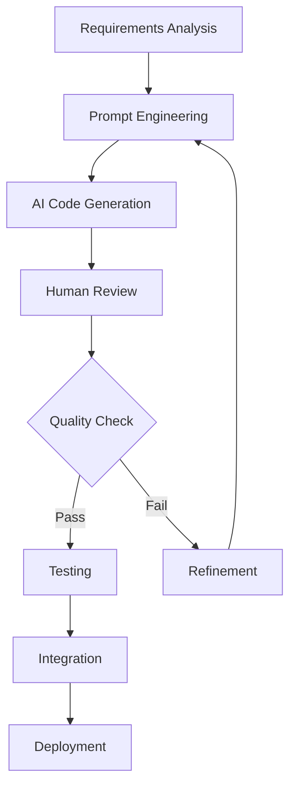

# AI Development Best Practices

> Comprehensive guide for AI-assisted development, prompt engineering, and production AI applications

## Table of Contents

- [Prompt Engineering](#prompt-engineering)
- [AI Model Selection](#ai-model-selection)
- [Code Generation Guidelines](#code-generation-guidelines)
- [RAG Implementation](#rag-implementation)
- [Security and Safety](#security-and-safety)
- [Performance Optimization](#performance-optimization)
- [Monitoring and Observability](#monitoring-and-observability)
- [Production Deployment](#production-deployment)

## Prompt Engineering

### Effective Prompt Patterns

#### 1. **Clear Context Setting**
```
# Good
You are a senior Python developer building a REST API using FastAPI.
Create a user authentication endpoint that:
- Uses JWT tokens
- Includes password hashing with bcrypt
- Has proper error handling
- Follows security best practices

# Bad
Create a login system
```

#### 2. **Structured Requirements**
```
Create a Python function with the following specifications:

Function Name: process_user_data
Input: List of user dictionaries
Output: Processed user statistics

Requirements:
1. Validate input data (non-empty, correct format)
2. Calculate average age, total users, active users
3. Handle missing or invalid data gracefully
4. Return structured response with error reporting
5. Include comprehensive logging
6. Add type hints and docstrings

Example Input:
[
  {"id": 1, "name": "John", "age": 30, "active": true},
  {"id": 2, "name": "Jane", "age": 25, "active": false}
]

Expected Output Format:
{
  "total_users": int,
  "active_users": int,
  "average_age": float,
  "errors": List[str]
}
```

#### 3. **Iterative Refinement**
```python
# Step 1: Basic functionality
# AI: Generate basic function structure

# Step 2: Add error handling
# Human: "Add comprehensive error handling for edge cases"

# Step 3: Optimize performance
# Human: "Optimize this function for processing large datasets (100k+ records)"

# Step 4: Add testing
# Human: "Generate comprehensive unit tests including edge cases and mocking"
```

### Prompt Templates

#### Code Review Template
```
Review this {language} code for:
1. Code quality and readability
2. Performance issues
3. Security vulnerabilities
4. Best practices compliance
5. Error handling completeness
6. Testing considerations

Code:
```{language}
{code}
```

Provide:
- Overall assessment (1-10 score)
- Specific issues with line references
- Improvement suggestions with examples
- Security considerations
- Performance optimization opportunities
```

#### Architecture Design Template
```
Design a {system_type} architecture for:

Requirements:
- {functional_requirements}
- {non_functional_requirements}
- {constraints}

Considerations:
- Scalability: {scale_requirements}
- Performance: {performance_requirements}
- Security: {security_requirements}
- Budget: {budget_constraints}

Provide:
1. High-level architecture diagram (text description)
2. Component breakdown with responsibilities
3. Technology stack recommendations
4. Data flow description
5. Deployment strategy
6. Monitoring and logging approach
7. Potential risks and mitigation strategies
```

## AI Model Selection

### Model Comparison Matrix

| Use Case | GPT-3.5-Turbo | GPT-4 | Claude-3 | Local Models | Best Choice |
|----------|---------------|-------|----------|-------------|-------------|
| **Code Generation** | Good | Excellent | Excellent | Fair | GPT-4/Claude-3 |
| **Code Review** | Good | Excellent | Excellent | Good | GPT-4/Claude-3 |
| **Documentation** | Excellent | Excellent | Excellent | Good | Any |
| **Debugging** | Good | Excellent | Good | Fair | GPT-4 |
| **Architecture Design** | Fair | Excellent | Excellent | Fair | GPT-4/Claude-3 |
| **Simple Tasks** | Excellent | Good | Good | Good | GPT-3.5-Turbo |
| **Privacy Sensitive** | No | No | No | Excellent | Local Models |
| **Cost Sensitive** | Excellent | Poor | Fair | Excellent | GPT-3.5/Local |
| **Speed Critical** | Excellent | Fair | Good | Excellent | GPT-3.5/Local |

### Model Selection Guidelines

```python
def select_model(task_complexity, privacy_level, budget, speed_requirement):
    """AI model selection logic."""
    
    if privacy_level == "high":
        return "local_model"
    
    if budget == "low" and task_complexity == "simple":
        return "gpt-3.5-turbo"
    
    if task_complexity in ["complex", "architecture"] and budget != "low":
        return "gpt-4" if speed_requirement != "critical" else "claude-3"
    
    if speed_requirement == "critical":
        return "gpt-3.5-turbo"
    
    return "gpt-4"  # Default for balanced requirements
```

## Code Generation Guidelines

### Quality Standards for AI-Generated Code

#### ✅ **Must Have**
- **Type hints** for all functions and variables
- **Comprehensive error handling** with specific exceptions
- **Logging** for debugging and monitoring
- **Docstrings** with examples and parameter descriptions
- **Input validation** for all user inputs
- **Security considerations** (sanitization, authentication)

#### ✅ **Should Have**
- **Unit tests** with edge cases
- **Performance optimization** for critical paths
- **Configuration management** for settings
- **Async/await** for I/O operations
- **Proper resource cleanup** (context managers)

#### ✅ **Nice to Have**
- **Integration tests** for complex workflows
- **Performance benchmarks** for critical functions
- **Documentation examples** and tutorials
- **Monitoring and metrics** collection

### Code Generation Workflow



### Example: High-Quality Code Generation

**Prompt:**
```
Create a Python class for handling user authentication with the following requirements:

1. JWT token generation and validation
2. Password hashing using bcrypt
3. Rate limiting for login attempts
4. Comprehensive error handling
5. Async support for database operations
6. Full type hints and documentation
7. Unit tests with mocking
8. Security logging for failed attempts

Include:
- Configuration management
- Custom exceptions
- Input validation
- Performance considerations
- Security best practices
```

**Expected Output Structure:**
```python
from typing import Optional, Dict, Any
import asyncio
import logging
from datetime import datetime, timedelta
import jwt
import bcrypt
from dataclasses import dataclass
import redis.asyncio as redis

@dataclass
class AuthConfig:
    """Authentication configuration."""
    jwt_secret: str
    jwt_algorithm: str = "HS256"
    jwt_expiry_hours: int = 24
    bcrypt_rounds: int = 12
    max_login_attempts: int = 5
    lockout_duration_minutes: int = 15

class AuthenticationError(Exception):
    """Custom authentication exception."""
    pass

class UserAuthenticator:
    """Production-ready user authentication system.
    
    Features:
    - JWT token generation and validation
    - Password hashing with bcrypt
    - Rate limiting and account lockout
    - Comprehensive logging
    - Async database support
    
    Example:
        >>> auth = UserAuthenticator(config, db_pool, redis_pool)
        >>> token = await auth.authenticate("user@example.com", "password123")
        >>> user_id = await auth.validate_token(token)
    """
    
    def __init__(self, 
                 config: AuthConfig,
                 db_pool: Any,
                 redis_pool: redis.Redis):
        self.config = config
        self.db_pool = db_pool
        self.redis = redis_pool
        self.logger = logging.getLogger(__name__)
    
    async def authenticate(self, email: str, password: str) -> str:
        """Authenticate user and return JWT token.
        
        Args:
            email: User email address
            password: Plain text password
            
        Returns:
            JWT token string
            
        Raises:
            AuthenticationError: If authentication fails
            
        Example:
            >>> token = await auth.authenticate("user@example.com", "password123")
        """
        # Implementation with proper error handling, logging, etc.
        pass
    
    # ... Additional methods with full implementation
```

## RAG Implementation

### RAG Architecture Patterns

#### 1. **Simple RAG**
```python
class SimpleRAG:
    """Basic RAG implementation for document Q&A."""
    
    def __init__(self, documents_path: str):
        self.embeddings = OpenAIEmbeddings()
        self.vector_store = self._build_vector_store(documents_path)
        self.llm = ChatOpenAI(model="gpt-3.5-turbo")
    
    async def query(self, question: str, k: int = 4) -> Dict[str, Any]:
        """Query documents and generate response."""
        # Retrieve relevant documents
        docs = self.vector_store.similarity_search(question, k=k)
        
        # Generate context-aware response
        context = "\n\n".join([doc.page_content for doc in docs])
        prompt = f"Context:\n{context}\n\nQuestion: {question}\nAnswer:"
        
        response = await self.llm.apredict(prompt)
        
        return {
            "answer": response,
            "sources": [doc.metadata for doc in docs],
            "confidence": self._calculate_confidence(docs, question)
        }
```

#### 2. **Advanced RAG with Reranking**
```python
class AdvancedRAG:
    """Advanced RAG with reranking and query optimization."""
    
    def __init__(self, config: RAGConfig):
        self.config = config
        self.embeddings = OpenAIEmbeddings()
        self.vector_store = self._setup_vector_store()
        self.reranker = CrossEncoder('cross-encoder/ms-marco-MiniLM-L-6-v2')
        self.llm = ChatOpenAI(model="gpt-4")
    
    async def query(self, question: str) -> Dict[str, Any]:
        """Advanced RAG query with reranking."""
        # Step 1: Query expansion
        expanded_queries = await self._expand_query(question)
        
        # Step 2: Retrieve candidates
        candidates = []
        for query in expanded_queries:
            docs = self.vector_store.similarity_search(query, k=10)
            candidates.extend(docs)
        
        # Step 3: Rerank documents
        reranked_docs = self._rerank_documents(question, candidates)
        
        # Step 4: Generate response
        response = await self._generate_response(question, reranked_docs[:4])
        
        return {
            "answer": response["text"],
            "sources": response["sources"],
            "confidence": response["confidence"],
            "query_expansion": expanded_queries,
            "total_candidates": len(candidates)
        }
```

### RAG Evaluation Metrics

```python
class RAGEvaluator:
    """Evaluate RAG system performance."""
    
    def evaluate_retrieval(self, questions: List[str], 
                         ground_truth_docs: List[List[str]]) -> Dict[str, float]:
        """Evaluate retrieval quality."""
        precision_scores = []
        recall_scores = []
        
        for question, true_docs in zip(questions, ground_truth_docs):
            retrieved_docs = self.rag.retrieve(question)
            retrieved_ids = [doc.metadata['id'] for doc in retrieved_docs]
            
            precision = len(set(retrieved_ids) & set(true_docs)) / len(retrieved_ids)
            recall = len(set(retrieved_ids) & set(true_docs)) / len(true_docs)
            
            precision_scores.append(precision)
            recall_scores.append(recall)
        
        return {
            "precision": np.mean(precision_scores),
            "recall": np.mean(recall_scores),
            "f1": 2 * np.mean(precision_scores) * np.mean(recall_scores) / 
                  (np.mean(precision_scores) + np.mean(recall_scores))
        }
    
    def evaluate_generation(self, questions: List[str],
                          generated_answers: List[str],
                          reference_answers: List[str]) -> Dict[str, float]:
        """Evaluate generation quality using multiple metrics."""
        # BLEU, ROUGE, BERTScore, etc.
        pass
```

## Security and Safety

### AI Security Checklist

#### Input Validation
- [ ] **Sanitize all user inputs** before sending to AI models
- [ ] **Validate input length** and format
- [ ] **Prevent injection attacks** in prompts
- [ ] **Rate limit API calls** per user/IP
- [ ] **Implement authentication** for AI endpoints

#### Output Safety
- [ ] **Content filtering** for inappropriate responses
- [ ] **PII detection** and redaction
- [ ] **Hallucination detection** for factual claims
- [ ] **Bias monitoring** in AI responses
- [ ] **Response validation** against business rules

#### Data Protection
- [ ] **Encrypt data in transit** and at rest
- [ ] **Implement data retention** policies
- [ ] **Audit all AI interactions**
- [ ] **Anonymize training data**
- [ ] **Secure API key management**

### Security Implementation

```python
class SecureAIService:
    """Production AI service with security controls."""
    
    def __init__(self, config: SecurityConfig):
        self.config = config
        self.rate_limiter = RateLimiter()
        self.content_filter = ContentFilter()
        self.pii_detector = PIIDetector()
        self.audit_logger = AuditLogger()
    
    async def secure_ai_call(self, user_id: str, prompt: str) -> Dict[str, Any]:
        """Make AI call with security controls."""
        # Rate limiting
        await self.rate_limiter.check_limit(user_id)
        
        # Input validation
        sanitized_prompt = self._sanitize_input(prompt)
        self._validate_prompt_safety(sanitized_prompt)
        
        # AI call with monitoring
        start_time = time.time()
        try:
            response = await self.ai_model.generate(sanitized_prompt)
            
            # Output safety checks
            safe_response = await self._ensure_output_safety(response)
            
            # Audit logging
            await self.audit_logger.log_interaction(
                user_id=user_id,
                prompt=sanitized_prompt,
                response=safe_response,
                duration=time.time() - start_time,
                status="success"
            )
            
            return {"response": safe_response, "safe": True}
            
        except Exception as e:
            await self.audit_logger.log_error(user_id, str(e))
            raise
    
    def _sanitize_input(self, prompt: str) -> str:
        """Sanitize user input."""
        # Remove/escape dangerous characters
        # Limit length
        # Check for injection patterns
        pass
    
    async def _ensure_output_safety(self, response: str) -> str:
        """Ensure AI response is safe."""
        # Content filtering
        if not self.content_filter.is_appropriate(response):
            raise ValueError("Inappropriate content detected")
        
        # PII detection and redaction
        cleaned_response = self.pii_detector.redact_pii(response)
        
        # Business rule validation
        self._validate_business_rules(cleaned_response)
        
        return cleaned_response
```

## Performance Optimization

### Optimization Strategies

#### 1. **Caching**
```python
class CachedAIService:
    """AI service with intelligent caching."""
    
    def __init__(self):
        self.cache = RedisCache()
        self.similarity_threshold = 0.85
    
    async def cached_generate(self, prompt: str) -> str:
        """Generate response with caching."""
        # Check for exact match
        cache_key = self._hash_prompt(prompt)
        cached_response = await self.cache.get(cache_key)
        
        if cached_response:
            return cached_response
        
        # Check for similar prompts
        similar_response = await self._find_similar_cached_response(prompt)
        if similar_response:
            return similar_response
        
        # Generate new response
        response = await self.ai_model.generate(prompt)
        
        # Cache with TTL
        await self.cache.set(cache_key, response, ttl=3600)
        
        return response
```

#### 2. **Batch Processing**
```python
class BatchAIProcessor:
    """Batch AI requests for efficiency."""
    
    def __init__(self, batch_size: int = 10, timeout: float = 2.0):
        self.batch_size = batch_size
        self.timeout = timeout
        self.pending_requests = []
        self.request_futures = {}
    
    async def process_request(self, prompt: str) -> str:
        """Add request to batch and wait for result."""
        future = asyncio.Future()
        request_id = uuid.uuid4().str
        
        self.pending_requests.append((request_id, prompt))
        self.request_futures[request_id] = future
        
        # Trigger batch processing if needed
        if len(self.pending_requests) >= self.batch_size:
            asyncio.create_task(self._process_batch())
        
        return await future
    
    async def _process_batch(self):
        """Process batch of requests."""
        if not self.pending_requests:
            return
        
        batch = self.pending_requests[:self.batch_size]
        self.pending_requests = self.pending_requests[self.batch_size:]
        
        # Process batch with AI model
        prompts = [prompt for _, prompt in batch]
        responses = await self.ai_model.batch_generate(prompts)
        
        # Resolve futures
        for (request_id, _), response in zip(batch, responses):
            if request_id in self.request_futures:
                self.request_futures[request_id].set_result(response)
                del self.request_futures[request_id]
```

#### 3. **Model Optimization**
```python
class OptimizedAIModel:
    """Optimized AI model with multiple strategies."""
    
    def __init__(self):
        self.models = {
            "fast": "gpt-3.5-turbo",
            "balanced": "gpt-4",
            "accurate": "gpt-4-32k"
        }
        self.complexity_classifier = ComplexityClassifier()
    
    async def smart_generate(self, prompt: str) -> str:
        """Choose optimal model based on complexity."""
        complexity = self.complexity_classifier.classify(prompt)
        
        if complexity == "simple":
            model = self.models["fast"]
        elif complexity == "medium":
            model = self.models["balanced"]
        else:
            model = self.models["accurate"]
        
        return await self._generate_with_model(prompt, model)
```

## Monitoring and Observability

### Comprehensive Monitoring Setup

```python
class AIServiceMonitoring:
    """Comprehensive monitoring for AI services."""
    
    def __init__(self):
        self.metrics = {
            'requests_total': Counter('ai_requests_total', 
                                    ['model', 'operation', 'status']),
            'request_duration': Histogram('ai_request_duration_seconds',
                                        ['model', 'operation']),
            'token_usage': Counter('ai_tokens_used_total', ['model']),
            'cost_tracking': Counter('ai_cost_total', ['model']),
            'error_rate': Counter('ai_errors_total', 
                                ['model', 'error_type']),
            'cache_hits': Counter('ai_cache_hits_total', ['cache_type'])
        }
        
        self.tracer = opentelemetry.trace.get_tracer(__name__)
        self.logger = structlog.get_logger()
    
    @contextmanager
    def trace_ai_request(self, operation: str, model: str):
        """Trace AI request with comprehensive monitoring."""
        start_time = time.time()
        
        with self.tracer.start_as_current_span(f"ai.{operation}") as span:
            span.set_attribute("ai.model", model)
            span.set_attribute("ai.operation", operation)
            
            try:
                yield span
                
                # Success metrics
                duration = time.time() - start_time
                self.metrics['requests_total'].labels(
                    model=model, operation=operation, status='success'
                ).inc()
                self.metrics['request_duration'].labels(
                    model=model, operation=operation
                ).observe(duration)
                
                span.set_status(opentelemetry.trace.Status(opentelemetry.trace.StatusCode.OK))
                
            except Exception as e:
                # Error metrics
                self.metrics['requests_total'].labels(
                    model=model, operation=operation, status='error'
                ).inc()
                self.metrics['error_rate'].labels(
                    model=model, error_type=type(e).__name__
                ).inc()
                
                span.set_status(
                    opentelemetry.trace.Status(
                        opentelemetry.trace.StatusCode.ERROR,
                        str(e)
                    )
                )
                
                self.logger.error(
                    "AI request failed",
                    operation=operation,
                    model=model,
                    error=str(e),
                    duration=time.time() - start_time
                )
                
                raise
```

### Health Monitoring

```python
class AIHealthMonitor:
    """Monitor AI service health and performance."""
    
    async def health_check(self) -> Dict[str, Any]:
        """Comprehensive health check."""
        checks = {
            "api_connectivity": await self._check_api_connectivity(),
            "model_availability": await self._check_model_availability(),
            "cache_connectivity": await self._check_cache(),
            "database_connectivity": await self._check_database(),
            "response_quality": await self._check_response_quality(),
            "rate_limits": await self._check_rate_limits()
        }
        
        overall_status = "healthy" if all(
            check["status"] == "healthy" for check in checks.values()
        ) else "unhealthy"
        
        return {
            "status": overall_status,
            "timestamp": datetime.now().isoformat(),
            "checks": checks,
            "version": "1.0.0"
        }
    
    async def _check_response_quality(self) -> Dict[str, Any]:
        """Check AI response quality with test prompts."""
        test_prompts = [
            "What is 2+2?",
            "Write a simple Python function to add two numbers",
            "Explain what machine learning is in one sentence"
        ]
        
        quality_scores = []
        
        for prompt in test_prompts:
            try:
                response = await self.ai_service.generate(prompt)
                score = self._evaluate_response_quality(prompt, response)
                quality_scores.append(score)
            except Exception:
                quality_scores.append(0)
        
        avg_quality = np.mean(quality_scores)
        
        return {
            "status": "healthy" if avg_quality > 0.7 else "degraded",
            "average_quality": avg_quality,
            "samples_tested": len(test_prompts)
        }
```

## Production Deployment

### Deployment Checklist

#### Pre-Deployment
- [ ] **Load testing** with realistic traffic patterns
- [ ] **Security audit** of all AI endpoints
- [ ] **Performance benchmarking** against SLA requirements
- [ ] **Failover testing** for model unavailability
- [ ] **Data privacy compliance** review
- [ ] **Cost projection** and budget approval

#### Infrastructure
- [ ] **Auto-scaling** configured for AI workloads
- [ ] **Load balancers** with health checks
- [ ] **CDN** for static assets and caching
- [ ] **Database optimization** for AI metadata
- [ ] **Monitoring and alerting** fully configured
- [ ] **Backup and recovery** procedures tested

#### CI/CD Pipeline
```yaml
# .github/workflows/ai-service-deploy.yml
name: AI Service Deployment

on:
  push:
    branches: [main]
    paths: ['ai-service/**']

jobs:
  test:
    runs-on: ubuntu-latest
    steps:
      - uses: actions/checkout@v4
      
      - name: Set up Python
        uses: actions/setup-python@v4
        with:
          python-version: '3.11'
      
      - name: Install dependencies
        run: |
          pip install -r ai-service/requirements.txt
          pip install pytest pytest-cov
      
      - name: Run tests
        run: |
          cd ai-service
          pytest --cov=. --cov-report=xml
      
      - name: AI Model Validation
        run: |
          cd ai-service
          python scripts/validate_models.py
      
      - name: Security Scan
        run: |
          cd ai-service
          bandit -r .
          safety check
      
      - name: Performance Test
        run: |
          cd ai-service
          python scripts/performance_test.py
  
  deploy-staging:
    needs: test
    runs-on: ubuntu-latest
    environment: staging
    
    steps:
      - name: Deploy to Staging
        run: |
          # Deploy to staging environment
          # Run smoke tests
          # Validate AI responses
          
  deploy-production:
    needs: deploy-staging
    runs-on: ubuntu-latest
    environment: production
    if: github.ref == 'refs/heads/main'
    
    steps:
      - name: Blue-Green Deployment
        run: |
          # Deploy to production with blue-green strategy
          # Gradual traffic shift
          # Monitor key metrics
          # Automatic rollback on issues
```

### Production Monitoring Dashboard

```python
# Grafana dashboard configuration for AI services
AI_DASHBOARD_CONFIG = {
    "dashboard": {
        "title": "AI Service Monitoring",
        "panels": [
            {
                "title": "Request Rate",
                "type": "stat",
                "targets": [{
                    "expr": "rate(ai_requests_total[5m])",
                    "legendFormat": "{{model}} - {{operation}}"
                }]
            },
            {
                "title": "Response Time",
                "type": "timeseries",
                "targets": [{
                    "expr": "histogram_quantile(0.95, ai_request_duration_seconds_bucket)",
                    "legendFormat": "95th percentile"
                }]
            },
            {
                "title": "Error Rate",
                "type": "timeseries",
                "targets": [{
                    "expr": "rate(ai_errors_total[5m]) / rate(ai_requests_total[5m])",
                    "legendFormat": "Error Rate"
                }]
            },
            {
                "title": "Token Usage",
                "type": "timeseries",
                "targets": [{
                    "expr": "rate(ai_tokens_used_total[1h])",
                    "legendFormat": "Tokens per hour - {{model}}"
                }]
            },
            {
                "title": "Cost Tracking",
                "type": "stat",
                "targets": [{
                    "expr": "increase(ai_cost_total[24h])",
                    "legendFormat": "Daily Cost - {{model}}"
                }]
            }
        ]
    }
}
```

---

## Conclusion

Following these best practices ensures that AI-assisted development is:

- **Secure** and privacy-compliant
- **Performant** and scalable
- **Reliable** and well-monitored
- **Cost-effective** and optimized
- **Maintainable** and well-documented

Regular review and updates of these practices as AI technology evolves is essential for continued success.